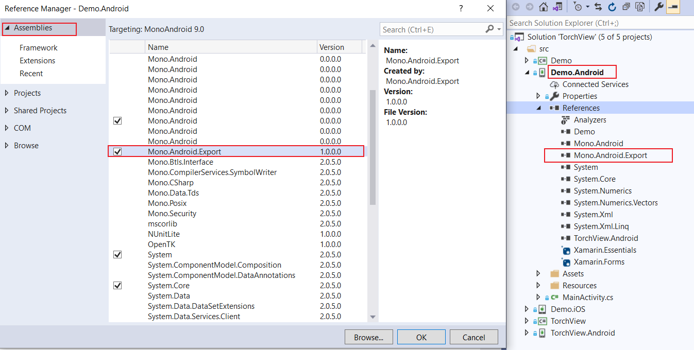

<p align="center">

</p>
<h1 align="center">TorchView</h1>

> Hybrid App for Xamarin, Xamarin combined with Vue.js and more.

[]()
[](https://github.com/yiyungent/TorchView/blob/main/LICENSE)


## Introduction

Hybrid App for Xamarin, Xamarin combined with Vue.js and more.

- **Simple** - enjoy 5 minutes installation, easy to get started.
- **Interactive** - Use JavaScript to call C#, use C# to call JavaScript

## Demo

- TODO

## Screenshots

- TODO


## Quick Start

> 1.Install TorchView in your Xamarin.Forms

```bash
PM> Install-Package TorchView
```


> 2.Install TorchView.Android in your Xamarin.Android

```bash
PM> Install-Package TorchView.Android
```


> __Note__
>
> If the installation is not successful through nuget, please try to download in `Releases` and manually add a reference to the dll.


> 3.Find `Xamarin.Android`, add your web file to `Assets/wwwroot` (wwwroot needs to be created)


> __Note__  
>  
> 
> 


> 4.Find `Xamarin.Forms`, add `HybridWebView` to the page you need,

```xaml
<?xml version="1.0" encoding="utf-8" ?>
<ContentPage xmlns="http://xamarin.com/schemas/2014/forms"
             xmlns:x="http://schemas.microsoft.com/winfx/2009/xaml"
             x:Class="Demo.MainPage"
             xmlns:com="clr-namespace:TorchView.Components;assembly=TorchView">

    <StackLayout HorizontalOptions="Center" VerticalOptions="Center">
        <Label HorizontalOptions="Center" VerticalOptions="Center" Text="Welcome to TorchView !" FontSize="16" BackgroundColor="LightBlue"></Label>
        <Button Clicked="Button_Clicked" Text="Invoke JavaScript Code"></Button>

        <com:HybridWebView x:Name="hybridWebView" Uri="http://torchview/index.html" WidthRequest="1000" HeightRequest="1000"></com:HybridWebView>
    </StackLayout>

</ContentPage>
```

> 5.Finished, now you can start your app


> __Note__
>
> In fact, you can use `this.hybridWebView` in `MainPage.xaml.cs` to complete more operations


```C#
namespace Demo
{
    public partial class MainPage : ContentPage
    {
        public MainPage()
        {
            InitializeComponent();

            this.hybridWebView.RegisterAction(data => DisplayAlert("Alert", "RegisterAction " + data, "OK"));

            this.hybridWebView.RegisterFunc(data => { return "RegisterFunc " + data; });


        }

        private async void Button_Clicked(object sender, EventArgs e)
        {
            string result = await this.hybridWebView.EvaluateJavaScriptAsync("document.getElementById('name').value");

            await DisplayAlert("Alert", "Get name value: " + result, "OK");
        }
    }
}
```


## Support

| TorchView | TorchView.Android |      |
| --------- | ----------------- | ---- |
|           | Android 5.0 (+)   |      |
|           |                   |      |
|           |                   |      |


> __Note__
>
> Currently does not support iOS.


| TorchView         | [](https://www.nuget.org/packages/TorchView/) | [](https://www.nuget.org/packages/TorchView/) |
| ----------------- | ------------------------------------------------------------ | ------------------------------------------------------------ |
| TorchView.Android | [](https://www.nuget.org/packages/TorchView.Android/) | [](https://www.nuget.org/packages/TorchView.Android/) |


## Environment

- Development: Visual Studio Community 2019,  Xamarin Development Kit


## Related Projects

- [yiyungent/OneTree.App](https://github.com/yiyungent/OneTree.App)


## Thanks


## Donate

TorchView is an Apache-2.0 licensed open source project and completely free to use. However, the amount of effort needed to maintain and develop new features for the project is not sustainable without proper financial backing.

We accept donations through these channels:

- <a href="https://afdian.net/@yiyun" target="_blank">爱发电</a>

## Author

**TorchView** © [yiyun](https://github.com/yiyungent), Released under the [Apache-2.0](./LICENSE) License.<br>
Authored and maintained by yiyun with help from contributors ([list](https://github.com/yiyungent/TorchView/contributors)).

> GitHub [@yiyungent](https://github.com/yiyungent) Gitee [@yiyungent](https://gitee.com/yiyungent)
